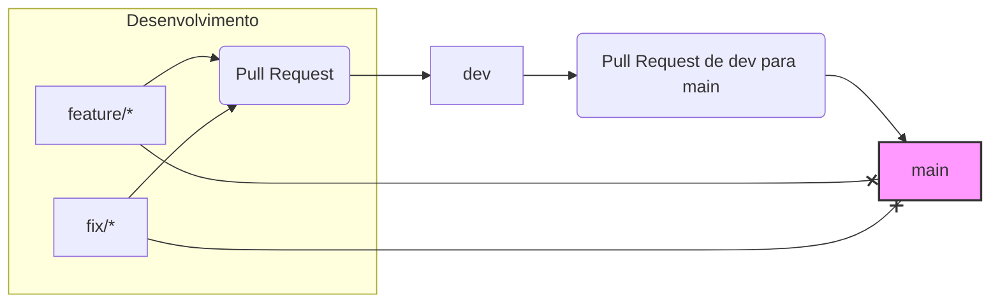

# Projeto Demo - Fluxo de Versionamento e Deploy com Proteção de Branches

Este repositório demonstra um fluxo de versionamento e deploy para microserviços com foco em controle de mudanças, rastreabilidade e qualidade de código, utilizando as funcionalidades de proteção de branches do GitHub.

## Estrutura de Branches

- **`main`**: Representa o código em produção. É protegida contra commits diretos e só pode receber mudanças via Pull Requests originados da branch `dev`.
- **`dev`**: Branch de integração. Todas as mudanças (features, correções, melhorias) devem ser integradas aqui via Pull Requests, após revisão e aprovação.

## Regras de Proteção

1. **Branch `dev`**:
   - Pull Requests exigem aprovação de revisores definidos via `CODEOWNERS`.
   - A revisão do time de DevOps é obrigatória.
   - Commits diretos são bloqueados.

2. **Branch `main`**:
   - Só aceita Pull Requests originados da branch `dev`.
   - Commits diretos e PRs de outras branches são bloqueados.
   - Deploy automático para produção é disparado após merge na `main`.

## Fluxo Resumido

Este fluxo garante que todas as mudanças passem por revisão técnica e validação antes de serem promovidas para produção, com rastreabilidade e controle via GitHub Actions e regras de proteção.

teste02
